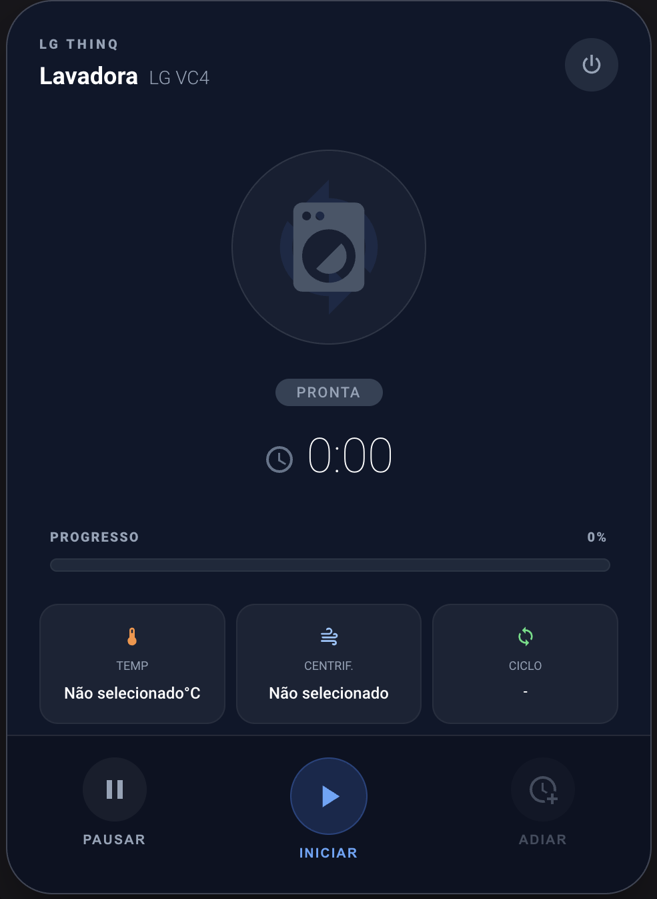

# LG Washer Card

Card customizável para máquinas de lavar **LG ThinQ** no Home Assistant, com versão completa e mini card simplificado.

[](https://github.com/hacs/integration)
[](https://github.com/SEU_USUARIO/lg-washer-card/releases)



## Funcionalidades

- Card completo para visual rico com controles e métricas detalhadas
- Mini card para layouts compactos com status resumido e ações principais
- Indicador visual com animação de rotação quando em funcionamento
- Barra de progresso dinâmica baseada no tempo restante
- Exibição de temperatura, centrifugação e ciclo atual
- Botões de pausar e iniciar remotamente
- Editor visual para configuração sem YAML
- Compatível com qualquer integração LG ThinQ (SmartThinQ)

## Instalação via HACS

1. Acesse **HACS → Frontend → Explorar e baixar repositórios**
2. Pesquise por **LG Washer Card**
3. Clique em **Baixar**
4. Reinicie o Home Assistant
5. Adicione o card via Interface → Editar Painel → **+ Adicionar Card** → **LG Washer Card** ou **LG Washer Mini Card**

### Instalação Manual

1. Faça o download do arquivo `lg-washer-card.js` da [última release](https://github.com/SEU_USUARIO/lg-washer-card/releases)
2. Coloque em `config/www/lg-washer-card.js`
3. Adicione como recurso em **Configurações → Dashboards → Recursos**:
   ```
   /local/lg-washer-card.js
   ```

## Configuração

Use o **editor visual** ou configure via YAML.

### Card completo

```yaml
type: custom:lg-washer-card
name: Lavadora
model: LG VC4
brand: LG ThinQ
entity: sensor.lavadora
temp_entity: sensor.lavadora_water_temp
spin_entity: sensor.lavadora_spin_speed
course_entity: sensor.lavadora_current_course
power_switch: switch.lavadora_power
pause_button: button.lavadora_pause
start_button: button.lavadora_remote_start
```

### Mini card

O mini card usa a mesma configuração do card completo, mudando apenas o tipo:

```yaml
type: custom:lg-washer-mini-card
name: Lavadora
model: LG VC4
brand: LG ThinQ
entity: sensor.lavadora
temp_entity: sensor.lavadora_water_temp
spin_entity: sensor.lavadora_spin_speed
course_entity: sensor.lavadora_current_course
power_switch: switch.lavadora_power
pause_button: button.lavadora_pause
start_button: button.lavadora_remote_start
```

### Tipos disponíveis

- `custom:lg-washer-card`: layout completo com informações detalhadas e controles visíveis
- `custom:lg-washer-mini-card`: layout compacto para dashboards com pouco espaço

| Opção | Descrição | Obrigatório |
|---|---|---|
| `entity` | Entidade principal da lavadora | ✅ |
| `name` | Nome exibido no card | ❌ |
| `model` | Modelo da máquina | ❌ |
| `brand` | Marca / subtítulo | ❌ |
| `temp_entity` | Sensor de temperatura da água | ❌ |
| `spin_entity` | Sensor de velocidade de centrifugação | ❌ |
| `course_entity` | Sensor do ciclo atual | ❌ |
| `power_switch` | Switch de energia | ❌ |
| `pause_button` | Botão de pausar | ❌ |
| `start_button` | Botão de iniciar remotamente | ❌ |
| `course_select` | Seletor de operação (select.*) | ❌ |
| `color_bg` | Cor de fundo do card (hex) | ❌ |
| `color_accent` | Cor de destaque/destaque (hex) | ❌ |
| `color_inactive` | Cor de ícone inativo (hex) | ❌ |
| `color_progress` | Cor da barra de progresso (hex) | ❌ |

## Atributos Esperados na Entidade Principal

O card utiliza os seguintes atributos da entidade principal:

- `run_state` — estado de execução (ex: `LAVANDO`)
- `remain_time` — tempo restante (formato `H:MM:SS`)
- `initial_time` — tempo total do ciclo

## Personalização de Cores

Você pode personalizar as cores do card usando os campos `color_*`. Use o editor visual do card para selecionar as cores ou configure via YAML:

```yaml
type: custom:lg-washer-card
entity: sensor.lavadora
name: Lavadora
color_bg: "#1a1a2e"
color_accent: "#00d4ff"
color_inactive: "#666666"
color_progress: "#00ff88"
```

- `color_bg` — Fundo do card (padrão: `#0f172a`)
- `color_accent` — Cor de destaque para ícones ativos e progresso (padrão: `#3b82f6`)
- `color_inactive` — Cor para ícones inativos (padrão: `#475569`)
- `color_progress` — Cor da barra de progresso (padrão: `#22d3ee`)

## Licença

MIT


